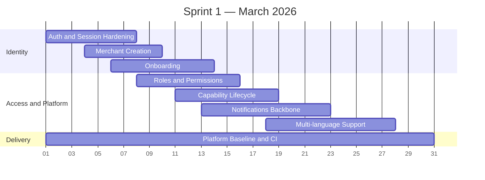

# Sprint 1 — Foundation (March 2026)

> **Period:** March 1 – March 31, 2026
> **Goal:** complete shared systems required by every later feature
> **Strategy:** [[sprint-strategy]]

| Workstream                 | Feature Coverage    | Target Outcomes                                                                                     |
| -------------------------- | ------------------- | --------------------------------------------------------------------------------------------------- |
| Auth and session hardening | Authentication      | Magic link or OTP, session refresh, logout, token expiry, security controls, audit logging          |
| Merchant creation          | Merchant Creation   | Existing user creates merchant, becomes owner, merchant record and default capability state created |
| Onboarding                 | Onboarding          | Consumer and merchant setup flows persist profile state and required metadata                       |
| Roles and permissions      | Roles & Permissions | Platform RBAC and merchant RBAC enforced across consumer, dashboard, POS, mod, and admin surfaces   |
| Capability lifecycle       | Capability model    | Disabled -> needs setup -> active -> suspended lifecycle implemented and visible                    |
| Notifications backbone     | Notifications       | Event generation, in-app delivery, email delivery, preferences, read state                          |
| Multi-language support     | Multi-language      | Locale persistence, translation loading, EN/JP/ID coverage for shared flows                         |
| Platform baseline          | Cross-cutting       | Schema migrations, environments, jobs, observability, seed data, CI and release flow                |

## Sprint 1 Exit Criteria

- Shared auth, onboarding, permissions, capabilities, notifications, and i18n are stable.
- Merchant creation works end to end.
- Later sprints can build on one consistent identity, authorization, and event foundation.

---

#halava #sprint #march #foundation
