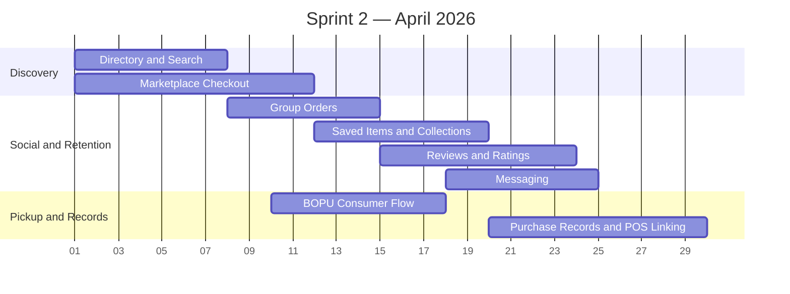

# Sprint 2 — Consumer Core (April 2026)

> **Period:** April 1 – April 30, 2026
> **Goal:** complete consumer experience across discovery, ordering, engagement, and trust
> **Strategy:** [[sprint-strategy]]

| Workstream | Feature Coverage | Target Outcomes |
|------------|------------------|-----------------|
| Directory and search | Directory: Place Pages, Search & Filters | Geo-search, halal trust metadata, ranking, place pages, search filters |
| Marketplace checkout | Marketplace | Cart, checkout, order placement, order tracking, storefront purchase flow |
| Group orders | Group Order | Invite, join, contribute, submit, participant breakdown, notifications |
| Saved items and collections | Saved Items | Bookmarks, saved filters, collection CRUD, sharing via token |
| Reviews and ratings | Reviews & Ratings | Review CRUD, ratings aggregates, verified purchase logic, moderation queue |
| Messaging | Messaging | Consumer-merchant conversations, merchant inbox integration, unread state |
| BOPU consumer flow | BOPU | Pickup selection, pickup windows, pickup QR, customer pickup flow |
| Purchase records and POS linking | Expense Insight foundation | Unified purchase record ingestion, QR linking to POS receipts, cross-channel purchase history foundation |

## Sprint 2 Exit Criteria

- Consumers can discover, order, join group orders, save items, review, message, and use pickup on live data.
- Consumer-side trust and engagement features are functional enough to support retention.
- Purchase records exist as the shared data foundation for Expense Insight.

---

#halava #sprint #april #consumer
