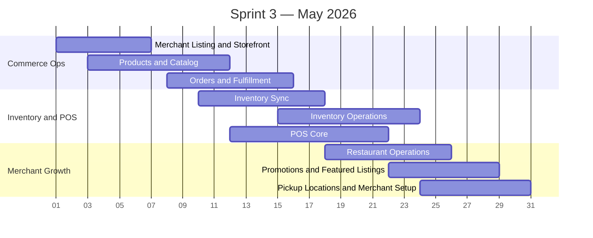

# Sprint 3 — Merchant Core (May 2026)

> **Period:** May 1 – May 31, 2026
> **Goal:** complete merchant operating workflows across catalog, fulfillment, stock, POS, and restaurant operations
> **Strategy:** [[sprint-strategy]]

| Workstream | Feature Coverage | Target Outcomes |
|------------|------------------|-----------------|
| Merchant listing and storefront | Directory merchant side, storefront publishing | Merchant place listing management, halal evidence fields, storefront data |
| Products and catalog | Products | Product CRUD, categories, imports/exports, photos, item-channel visibility |
| Orders and fulfillment | Order Management | Merchant order inbox, status flow, shipping, pickup handling, order preferences |
| Inventory sync | Inventory core | Shared stock events across marketplace, POS, and restaurant channels |
| Inventory operations | Inventory advanced | Adjustments log, stocktake, alerts, reorder thresholds, variance approval |
| POS core | POS | Cashier flow, offline sync, receipt generation, transaction history, quota visibility |
| Restaurant operations | Restaurant Operations, Menu Management, QR Menu, Kitchen Queue | Menu CRUD, modifiers, QR ordering, kitchen queue, dine-in and takeout flow |
| Promotions and featured listings | Promotions | Coupon logic, usage tracking, automatic discounts, featured listings |
| Pickup locations and merchant setup | BOPU merchant side | Pickup location CRUD, hours, prep windows, capacity, pickup readiness rules |

## Sprint 3 Exit Criteria

- Merchants can run core catalog, fulfillment, stock, POS, and restaurant workflows on shared live data.
- Inventory remains consistent across channels.
- Merchant-side promotion and pickup management are usable in production.

---

#halava #sprint #may #merchant
