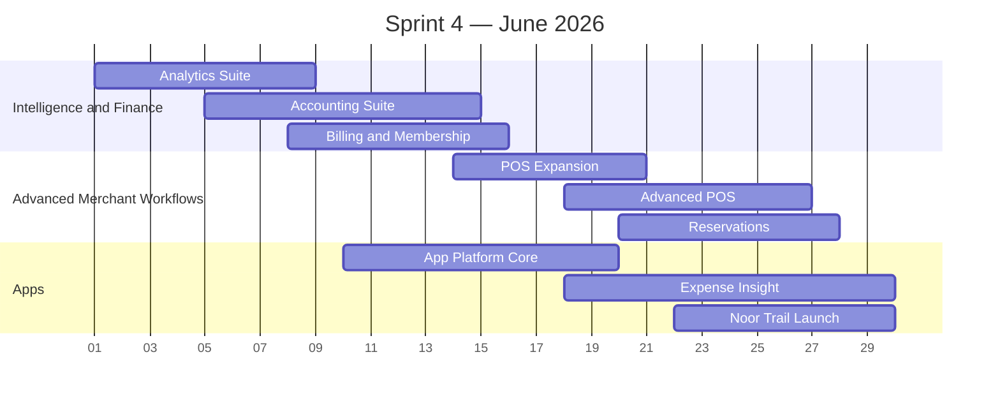

# Sprint 4 — Advanced Merchant Features and Consumer App Platform (June 2026)

> **Period:** June 1 – June 30, 2026
> **Goal:** complete advanced merchant features and consumer app platform delivery for launch
> **Strategy:** [[sprint-strategy]]

| Workstream | Feature Coverage | Target Outcomes |
|------------|------------------|-----------------|
| Analytics suite | Merchant analytics | KPIs, sales, customers, products, channels, trends, shared metric definitions |
| Accounting suite | Accounting | Sales ledger, expenses, invoices, PDF generation, tax export |
| Billing and membership | Billing & Membership | Plan logic, quota rules, top-ups, fee waiver behavior, billing events |
| POS expansion | POS detail workflows | Prepared orders, transaction detail, refunds, receipt reprint, cashier follow-up actions |
| Advanced POS | Advanced POS | Tables, split bills, modifiers in POS, dining cashier workflows |
| Reservations | Reservations | Slot generation, booking lifecycle, merchant reservation management, cancellation rules |
| App platform core | App Platform | Install flow, app shell, permissions, updates, app catalog |
| Expense Insight | Expense Insight | Purchase history, insights, price history, budgets, exports, POS-linked receipts |
| Launch app set | `noor-trail` | Launch-ready implementation integrated into app platform runtime |

## Sprint 4 Exit Criteria

- Finance, reporting, billing, and advanced merchant tools run on live transactional data.
- App Platform is ready to launch with Expense Insight and Noor Trail.
- Reservations and advanced POS workflows are usable for restaurant and hybrid merchants.

---

#halava #sprint #june #finance #apps
