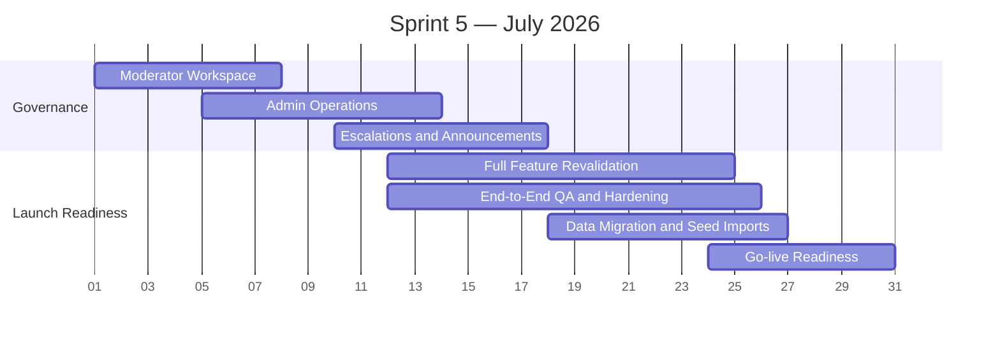

# Sprint 5 — Governance and Launch (July 2026)

> **Period:** July 1 – July 31, 2026
> **Goal:** complete internal operations, platform governance, and production launch readiness
> **Strategy:** [[sprint-strategy]]

| Workstream | Feature Coverage | Target Outcomes |
|------------|------------------|-----------------|
| Moderator workspace | Admin & Moderation (moderator) | Reports queue, content review, moderation actions, audit log |
| Admin operations | Admin & Moderation (admin) | User management, merchant management, platform health views |
| Escalations and announcements | Admin governance | Escalation handling, platform settings, announcements, maintenance controls |
| Full feature revalidation | All features in [[sprint-strategy#Sprint Coverage Matrix]] | Every feature is rechecked with integration tests, contract checks, data integrity checks, and cross-role scenario validation |
| End-to-end QA and hardening | Cross-product | Regression suite, performance, security, i18n completeness, operational monitoring |
| Data migration and seed imports | Launch readiness | Merchant import, place data, catalog seeding, starter app catalog, staged rollout data |
| Go-live readiness | Launch readiness | Runbooks, support handoff, incident response, release checklist, production cutover |

## Sprint 5 Recheck Matrix

| Domain | Required Recheck in Sprint 5 |
|--------|-------------------------------|
| Shared features | Integration tests for authentication, onboarding, RBAC, capabilities, notifications, and i18n across consumer and merchant paths |
| Consumer features | End-to-end tests for directory, marketplace checkout, group order, BOPU, saved items, reviews, messaging, and purchase record linking |
| Merchant features | Integration tests for products, order management, inventory, POS, promotions, restaurant operations, accounting, reservations, and advanced POS |
| Platform and apps | Integration tests for app platform, Expense Insight, launch apps, billing and membership, moderation, and admin operations |
| Cross-cutting | API contract checks, migration verification, data consistency checks, monitoring and alert checks, and role-permission regression tests |

## Sprint 5 Exit Criteria

- Moderators and admins can operate the platform without direct database intervention.
- Every feature in [[sprint-strategy#Sprint Coverage Matrix]] passes Sprint 5 integration recheck.
- Core user, merchant, POS, restaurant, analytics, billing, and app flows pass end-to-end validation.
- Blocking defects from full-feature recheck are resolved or explicitly deferred with approved risk notes.
- Launch runbooks, support readiness, and rollback paths are complete.

---

#halava #sprint #july #governance #launch
