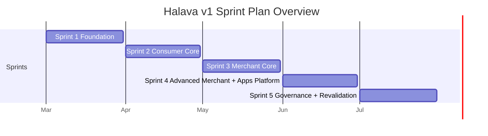

# Halava — Sprint Strategy (v1)

> **Purpose:** Agile sprint plan for finishing Halava v1 features end-to-end
> **Period:** March 1 – July 31, 2026
> **Cadence:** 1 sprint = 1 month
> **Related:** [[web-app-spec]] · [[routes-spec]] · [[roadmap]] · [[architecture]] · [[data-model]]

---

## Scope

This sprint strategy covers the full Halava v1 delivery:

- All product features are defined in [[web-app-spec]]
- all feature documents under `kms/features/`
- platform items referenced elsewhere in KMS, including Messaging, Billing & Membership, App Platform, and launch apps
- cross-cutting implementation work required to finish features in production quality

This document is the sprint-level source of truth. Route presence is not treated as completion.

---

## Sprint Model

- Each sprint lasts one calendar month.
- Each sprint must deliver integrated feature progress, not isolated route work.
- Features can span multiple sprints, but each sprint must end with a testable increment.
- Cross-cutting systems should land before the dependent feature is polished.

### Sprint Shape

| Week   | Focus                                                             |
| ------ | ----------------------------------------------------------------- |
| Week 1 | Architecture, schema, contracts, backlog lock                     |
| Week 2 | Core implementation and primary flows                             |
| Week 3 | Integration across consumer, merchant, POS, and platform surfaces |
| Week 4 | QA, hardening, demo, docs, and carryover decisions                |

### Delivery Rules

- Treat every feature as an end-to-end implementation effort.
- No feature is complete until auth, permissions, loading states, empty states, error handling, auditability, and i18n are covered.
- No feature is complete until UI behavior, backend logic, APIs, persistence, and production operations all work together.
- Reuse shared entities across channels: `Merchant`, `Item`, `Order`, `POSTransaction`, `Review`, `Notification`, and `MerchantCapability`.
- Build around the capability model so merchants can enable features progressively without business-type lock-in.
- Use one order domain across marketplace, group order, pickup, restaurant, and POS-linked transactions where possible.
- End every sprint with seeded end-to-end validation, not only isolated API checks.

---

## Sprint Overview

| Sprint | Period | Sprint Goal                                                                     | Detail                              |
| ------ | ------ | ------------------------------------------------------------------------------- | ----------------------------------- |
| 1      | March  | Finish shared foundations required by every feature area                        | [[sprint-1-march-foundation]]       |
| 2      | April  | Finish consumer-facing commerce and engagement flows                            | [[sprint-2-april-consumer-core]]    |
| 3      | May    | Finish merchant operations across orders, inventory, POS, and restaurant basics | [[sprint-3-may-merchant-core]]      |
| 4      | June   | Finish advanced merchant features and consumer app platform delivery            | [[sprint-4-june-advanced-merchant-app-platform]]      |
| 5      | July   | Finish governance, full feature revalidation, and launch readiness              | [[sprint-5-july-governance-launch]] |

---

## Sprint Coverage Matrix

This matrix is the KMS coverage check. Every feature mentioned in the KMS core set is assigned to at least one sprint.

| Domain | Feature | KMS Source | Sprint |
|--------|---------|------------|--------|
| Shared | Authentication | `kms/features/shared/authentication.md` | Sprint 1 |
| Shared | Onboarding | `kms/features/shared/onboarding.md` | Sprint 1 |
| Platform | Roles & Permissions | `kms/features/platform/roles-permissions.md` | Sprint 1 |
| Shared | Merchant Creation | `[[roadmap]]`, `[[routes-spec]]` | Sprint 1 |
| Shared | Capability Lifecycle | `[[web-app-spec#Capability Model]]` | Sprint 1 |
| Shared | Notifications | `kms/features/shared/notifications.md` | Sprint 1 |
| Shared | Multi-language Support | `kms/features/shared/multi-language.md` | Sprint 1 |
| Shared | Directory: Place Pages | `[[web-app-spec]]`, `kms/features/shared/directory.md` | Sprint 2 |
| Shared | Directory: Search & Filters | `[[web-app-spec]]`, `kms/features/shared/directory.md` | Sprint 2 |
| Shared | Marketplace | `kms/features/shared/marketplace.md` | Sprint 2-3 |
| Shared | Messaging | `[[web-app-spec]]`, `[[roadmap]]`, `[[routes-spec]]` | Sprint 2 |
| Consumer | Group Order | `kms/features/consumer/group-purchase.md` | Sprint 2 |
| Consumer | BOPU | `kms/features/consumer/bopu.md` | Sprint 2-3 |
| Consumer | Reviews & Ratings | `kms/features/consumer/reviews-ratings.md` | Sprint 2 |
| Consumer | Saved Items | `kms/features/consumer/saved-items.md` | Sprint 2 |
| Consumer App | Expense Insight | `kms/features/consumer/expense-insight.md` | Sprint 4 |
| Merchant | Products | `kms/features/merchant/products.md` | Sprint 3 |
| Merchant | Order Management | `kms/features/merchant/order-management.md` | Sprint 3 |
| Merchant | Inventory | `kms/features/merchant/inventory.md` | Sprint 3 |
| Merchant | POS Core | `kms/features/merchant/pos.md` | Sprint 3 |
| Merchant | Promotions | `kms/features/merchant/promotions.md` | Sprint 3 |
| Merchant | Restaurant Operations | `kms/features/merchant/restaurant-ops.md` | Sprint 3-4 |
| Merchant | Menu Management | `kms/features/merchant/restaurant-ops.md` | Sprint 3 |
| Merchant | QR Menu | `kms/features/merchant/restaurant-ops.md` | Sprint 3 |
| Merchant | Kitchen Queue | `kms/features/merchant/restaurant-ops.md` | Sprint 3 |
| Merchant | Reservations | `kms/features/merchant/restaurant-ops.md` | Sprint 4 |
| Merchant | Advanced POS | `kms/features/merchant/pos.md` | Sprint 4 |
| Merchant | Accounting | `kms/features/merchant/accounting.md` | Sprint 4 |
| Platform | Billing & Membership | `[[roadmap]]`, `[[routes-spec]]`, `[[monetization]]` | Sprint 4 |
| Platform | App Platform | `[[web-app-spec]]`, `[[routes-spec]]` | Sprint 4 |
| Platform | Launch app: `expense-insight` | `[[routes-spec]]`, `kms/features/consumer/expense-insight.md` | Sprint 4 |
| Platform | Launch app: `noor-trail` | `[[routes-spec]]` | Sprint 4 |
| Platform | Admin & Moderation | `kms/features/platform/admin-moderation.md` | Sprint 5 |

---

## Cross-sprint Dependencies

- **Sprint 1** is foundational for all later work: identity, RBAC, capabilities, notifications, and i18n must stabilize first.
- **Sprint 2** establishes the shared order and purchase record flows used later by merchant ops, analytics, and Expense Insight.
- **Sprint 3** produces the operational data required for finance, reporting, reservations, and advanced POS.
- **Sprint 4** depends on clean cross-channel data from Sprints 2 and 3.
- **Sprint 5** depends on all user-facing and merchant-facing workflows being stable enough to support governance and launch hardening, then rechecks the full feature matrix with integration tests before go-live.

---

## Definition of Done

A feature or sprint workstream is only complete when:

1. UI behavior and backend behavior match the spec
2. APIs, persistence, and background jobs are production-ready
3. auth, permissions, capabilities, and auditability are enforced
4. loading, empty, success, and failure states are handled
5. notifications and analytics events are wired where relevant
6. EN, JP, and ID coverage exists for user-facing flows
7. automated tests and seeded end-to-end validation cover the primary path

---

## Success Criteria

- Consumers can discover, order, pick up, review, save, message, and track halal spending end to end.
- Merchants can operate listings, products, orders, inventory, POS, restaurant workflows, promotions, billing, analytics, and accounting from one platform.
- POS transactions can be linked to consumer accounts and appear in unified purchase history.
- Merchant capabilities can be enabled incrementally without business-type lock-in or data migration.
- Internal teams can moderate content, manage users and merchants, publish announcements, and operate the platform safely.

---

## Risks and Buffer

| Risk | Mitigation |
|------|------------|
| Order model fragmentation across marketplace, POS, pickup, and restaurant flows | Establish shared order contracts by Sprint 2 and enforce them across later sprints |
| Inventory drift between channels | Make stock events and reconciliation mandatory in Sprint 3 |
| Analytics and accounting built on incomplete events | Freeze KPI definitions and finance events before Sprint 4 implementation |
| Expense Insight blocked by missing purchase records | Make purchase record ingestion a Sprint 2 requirement |
| App Platform launch too broad | Ship platform core plus a tightly defined launch app set in Sprint 4 |
| Governance tools designed without real workflows | Validate moderator and admin cases against seeded live-like data in Sprint 5 |

Each sprint should reserve its final week for integration fixes, regression hardening, and review outcomes.

---

#halava #strategy #implementation #sprints #planning
